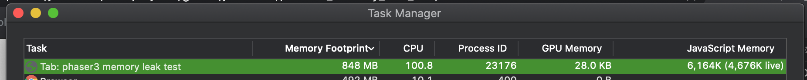

# phaser3_memory_leak_test

Just test memory leak issue

Browser: Chrome Version 87.0.4280.141 (Official Build) (x86_64)
OS: macos

## image

Just test the same URL of the picture added 1000 times (diff `key`)
-> then textures.remove(key) `for loop remove all keys`
-> then switch to next scene
-> the memory no release (memory usage from 40MB to 464MB).

`Expect: Memory should be reduced back to less than 100MB`

## audio

Just test the same URL of the audio added 10 times (diff `key`)
-> then cache.audio.remove(key) `for loop remove all keys`
-> then switch to next scene

- use web audio

`Expect: Memory should be reduced back to less than 100MB`

- use html5 audio (disableWebAudio=true)

html5 audio work fine, the memory no leak.
